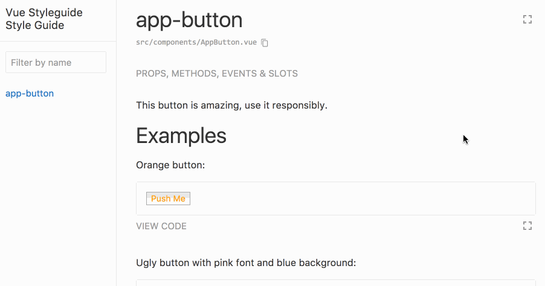

# Vue Styleguidist Example



This repo shows how to use [vue-styleguidist](https://github.com/vue-styleguidist/vue-styleguidist/) with a minimal setup by using just [Poi](poi.js.org).

## Getting started

Clone and install deps:

```bash
git clone https://github.com/IreneMaryanne/vue-styleguidist-example-js.git
cd vue-styleguidist-example-js
npm install
```

Run styleguidist by running:

```bash
npm run styleguide
```
